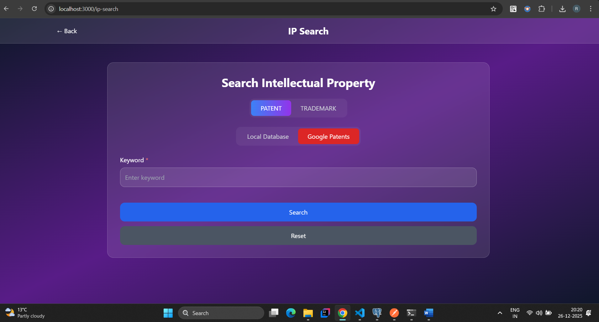
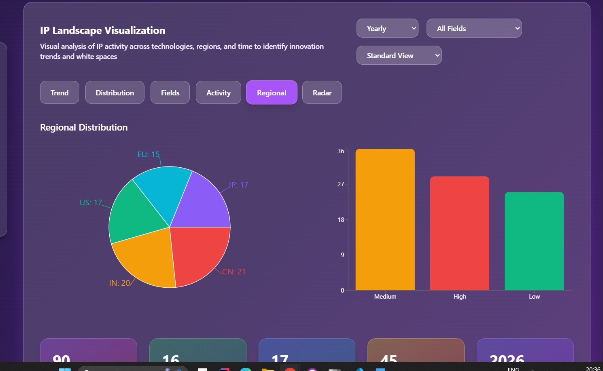
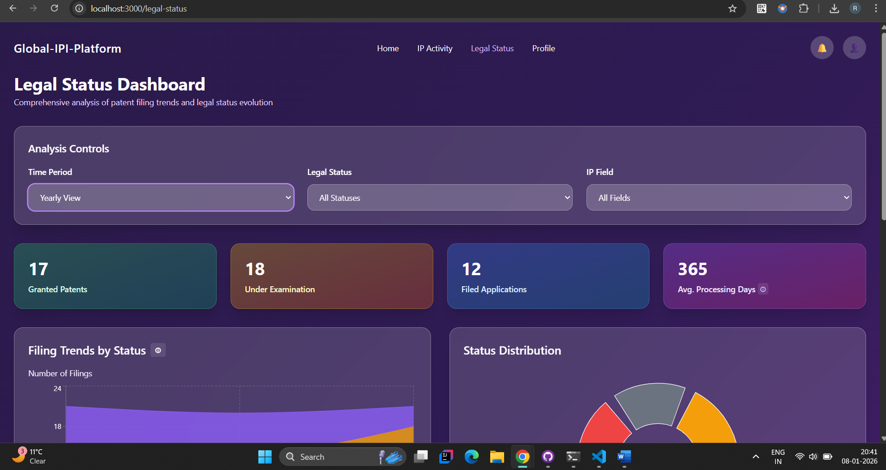
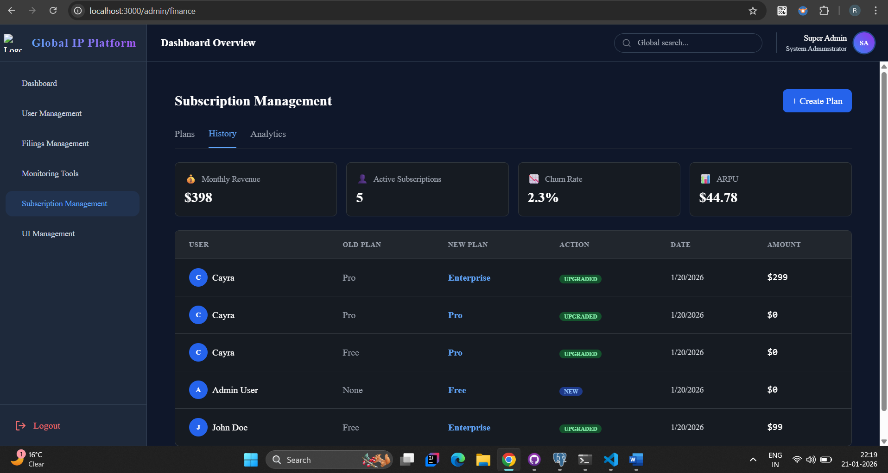
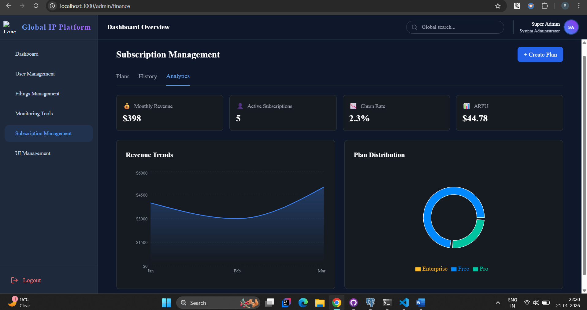
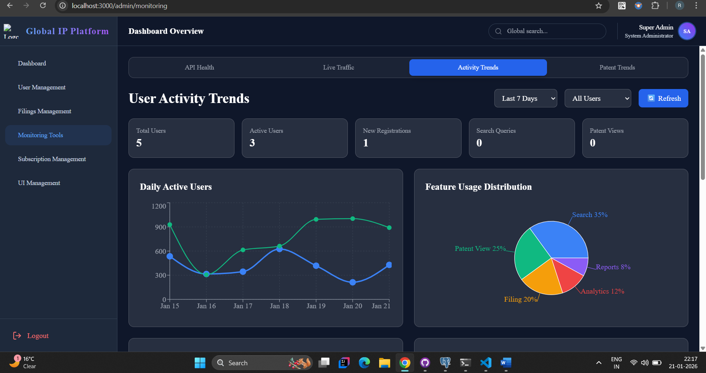

# 🌍 Global IP Intelligence Platform

A React-based analytics dashboard platform engineered to centralize, monitor, and visualize global patent data across jurisdictions, backed by secure Spring Boot APIs.

This project was developed as part of the Infosys Springboard Internship Program.


Built using **Spring Boot, PostgreSQL, and React**, this platform delivers structured patent insights, legal status tracking, filing analytics, and secure role-based dashboards for users and administrators.

---

## 🚀 Vision

Global intellectual property data is distributed across multiple jurisdictional sources, making centralized analysis complex and inefficient.

This platform solves that by:

- Aggregating IP data from official government APIs
- Structuring and storing data in PostgreSQL
- Providing secure REST APIs
- Delivering a responsive analytics dashboard
- Enabling role-based access control

---

## 🏗️ System Architecture

```
Client (React + Tailwind)
    → REST APIs (Spring Boot)
        → Service Layer
            → JPA / Hibernate
                → PostgreSQL
```

---

## 🛠️ Tech Stack

### Frontend
- React (Hooks, Context API)
- React Router
- Axios
- Tailwind CSS
- Recharts

---

### Backend
- Java 17
- Spring Boot
- Spring Data JPA
- PostgreSQL
- Spring Security
- DTO & Mapper Pattern
- Maven

---

## 🔐 Core Features

- Global patent data handling
- Legal status tracking
- Under examination monitoring
- Role-based authentication (Admin / User)
- Subscription management module
- Structured REST APIs
- Clean layered architecture

---

## 📊 Key Modules

### 1️⃣ Patent Filing Management
Handles structured storage and retrieval of global patent filing data.  
Supports querying by jurisdiction, status, and filing timelines.

### 2️⃣ Legal Status Monitoring
Tracks examination progress, publication status, grants, and other legal transitions.  
Designed to centralize fragmented status updates from official IP sources.

### 3️⃣ Dashboard Analytics
Provides summarized insights such as:
- Under examination counts
- Filing trends
- Status distribution
- Role-based analytics views

### 4️⃣ Admin Control Panel
Enables administrators to:
- Manage users
- Oversee subscriptions
- Control system-level operations
- Monitor platform activity

### 5️⃣ Subscription Services
Manages access tiers, subscription lifecycle, and feature restrictions  
based on user roles and plan type.

### 6️⃣ Secure Authentication System
Implements role-based access control using Spring Security and JWT.  
Ensures protected API endpoints and controlled frontend rendering.

---

## 📂 Project Structure

```
global-ip-intelligence-platform/
│
├── backend/     
├── frontend/    
├── LICENSE
├── README.md
└── .gitignore
```

---

## ⚙️ Running Locally

### Backend
```
cd backend
mvn clean install
mvn spring-boot:run
```

Runs at:  
`http://localhost:8080`

### Frontend
```
cd frontend
npm install
npm start
```

Runs at:  
`http://localhost:3000`

> Ensure backend is running before starting frontend.

---

## 🧠 Engineering Highlights

- Frontend-driven architecture with secure REST API integration
- Role-based UI rendering with JWT authentication
- Data-driven dashboard and visualization modules
- Modular subscription & monitoring services
- Clean layered backend architecture

---

## 👩‍💻 My Contributions

- Designed and implemented responsive analytics dashboards using React & Recharts
- Built Legal Status and Landscape visualization modules
- Implemented role-based UI rendering and protected routes
- Integrated secure Spring Boot REST APIs using Axios
- Designed PostgreSQL schema with JPA mapping (backend collaboration)
- Implemented DTO & Mapper pattern for clean API communication
- Optimized frontend data rendering with pagination & caching
- Contributed to monitoring and subscription modules

---

## 🔮 Future Enhancements

- AI-driven patent trend analysis
- Advanced filtering & search
- Real-time legal updates
- Cloud deployment (Docker / AWS / Render)
- Advanced data visualization

---

## 📌 Why This Project Matters

This project demonstrates:

- Advanced frontend dashboard development
- Secure API integration
- Data-driven UI architecture
- Integration with external services
- Role-based interface control
- Scalable component-based design

---

## 🖥️ Application Preview

### IP Search


### IP Landscape Visualization - Regional


### Legal Status Dashboard


### Admin - Subscription Management - History


### Admin - Subscription Management - Analytics


### Admin - Monitoring Tools


## 🎥 Demo Video
Watch full project walkthrough:
[Project Demo Video](https://youtu.be/LQ9Q8jT9Fhk)

Demo covers login flow, dashboard analytics, IP search integration, patent filing, admin monitoring, and role-based access.
